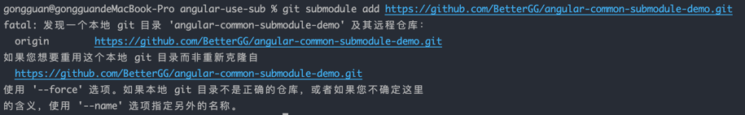

# angular-common-submodule-demo
submodule 的 demo

# 尝试公共组件

## 添加子项目
```
git submodule add <子项目git地址> <存放子项目的相对路径>
eg:
git submodule add https://github.com/BetterGG/angular-common-submodule-demo.git ./src/angularCommonSubmoduleDemo
```
问题：
遇见报错Working tree has modifications.  Cannot add.
先commit当前更改，再重新执行上述命令


遇见报错：SSL certificate problem: unable to get local issuer certificate
管理员命令行，执行`git config --system http.sslverify false`

## 基本命令
git submodule init // 初始化子模块
git submodule update // 更新子模块与主仓库中的子模块代码同步
// or
git submodule update --init
// or 嵌套的(子仓库中包含子仓库)
git submodule update --init --recursive

## 更新、拉取子仓库代码方法
git submodule update // 与主仓库中的子模块代码同步
git submodule update --remote // 与子仓库中代码同步（同步所有的子模块）
git submodule update --remote xxx // 指定需要同步的子模块

## 删除submodule
1. 删除 .gitmodules 文件中相关的内容
```
-[submodule "editorjs"]
-        active = true
-        url = https://github.com/codex-team/editor.js
```
2. 删除.git/config 文件中相关内容
```
-[submodule "editorjs"]
-        active = true
-        url = https://github.com/codex-team/editor.js
```
3. 删除缓存
```
git rm --cached path_to_submodule (no trailing slash)
```
4. 删除 .git/modules下面目录
```
rm -rf .git/modules/path_to_submodule (no trailing slash)
```
5. 删除 子目录
```
rm -rf path_to_submodule
```
6. 提交更改
```
git commit -am "Remove submodule"
```

## 错误解读


这个错误提示表明，您尝试添加的 Git 子模块 https://github.com/BetterGG/angular-common-submodule-demo.git 已经作为一个独立的 Git 仓库存在于您的本地工作目录中，其目录名为 angular-common-submodule-demo。Git 子模块功能不允许您将一个已经存在的本地 Git 仓库作为另一个仓库的子模块。

解决这个问题有几种方法：

使用 --force 选项：
如果您确定要重用本地已经存在的 Git 仓库作为子模块，并且您希望 Git 跳过克隆步骤直接使用这个本地仓库，您可以使用 --force 选项。这将把现有的本地仓库作为子模块添加到父仓库中。

```
git submodule add --force https://github.com/BetterGG/angular-common-submodule-demo.git
```
使用 --force 选项时请小心，因为它会覆盖任何现有的子模块配置。

重命名本地仓库：
如果您不想重用现有的本地仓库，而是想将其作为一个新的、独立的仓库来对待，您可以重命名现有的本地仓库目录，然后再尝试添加子模块。

```
mv angular-common-submodule-demo angular-common-submodule-demo-old
```
git submodule add https://github.com/BetterGG/angular-common-submodule-demo.git
这样，Git 将从指定的 URL 克隆新的子模块到 angular-common-submodule-demo 目录中。

指定不同的子模块路径：
如果您想要保留现有的本地仓库，同时还想添加一个新的子模块，您可以为子模块指定一个不同的本地路径。

```
git submodule add --name new-submodule-name https://github.com/BetterGG/angular-common-submodule-demo.git path/to/new-submodule
```
这里，--name 选项用于指定子模块在父仓库中的名称，path/to/new-submodule 是您希望子模块出现在父仓库中的路径。

检查并清理现有的本地仓库：
如果您确定不再需要现有的本地仓库，您可以删除它，然后重新尝试添加子模块。

```
rm -rf angular-common-submodule-demo  
git submodule add https://github.com/BetterGG/angular-common-submodule-demo.git
```
这将确保 Git 能够从远程仓库克隆一个新的子模块副本。

在选择解决方案时，请确保您了解每个选项的含义和后果，并根据您的项目需求做出合适的选择。
